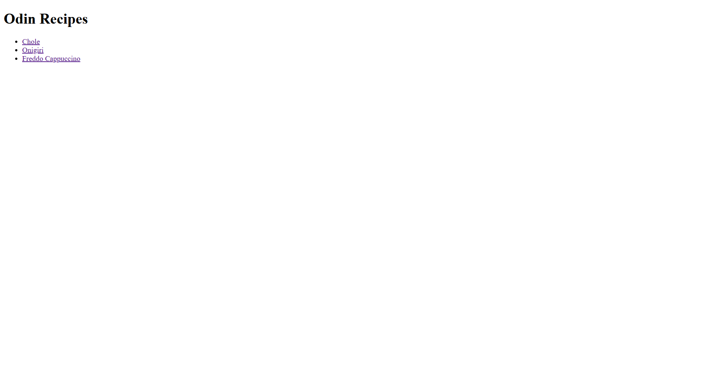
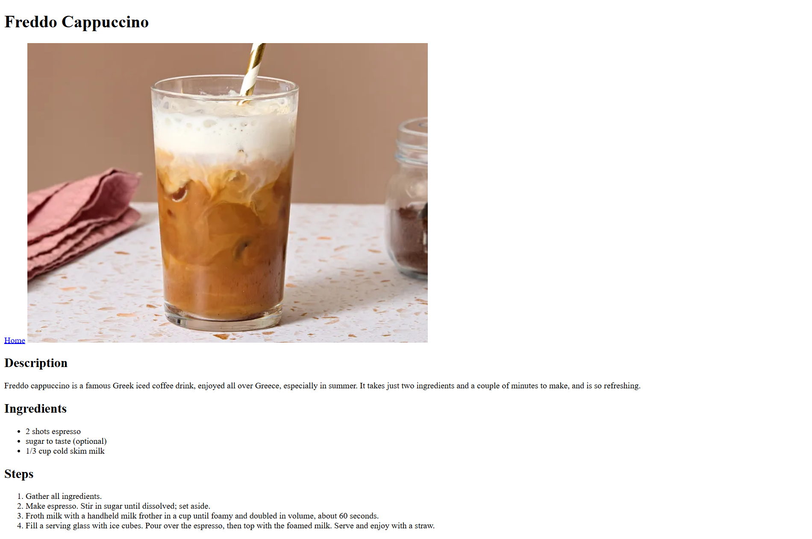

**TITLE**

Recipes site with multiple Pages build on solely HTML

**ABOUT**

This Project help me got out of "tutorial hell" as they called it.
It is build outside of help on from the web. or any tutorials 
It's not much but. I can call it a Start.
I have worked with linking pages with Absolute and Relative links 
with Images, And Proper Semantic HTML.

**SCREENSHOTS**

**HOMEPAGE**

**RECIPES PAGES**

